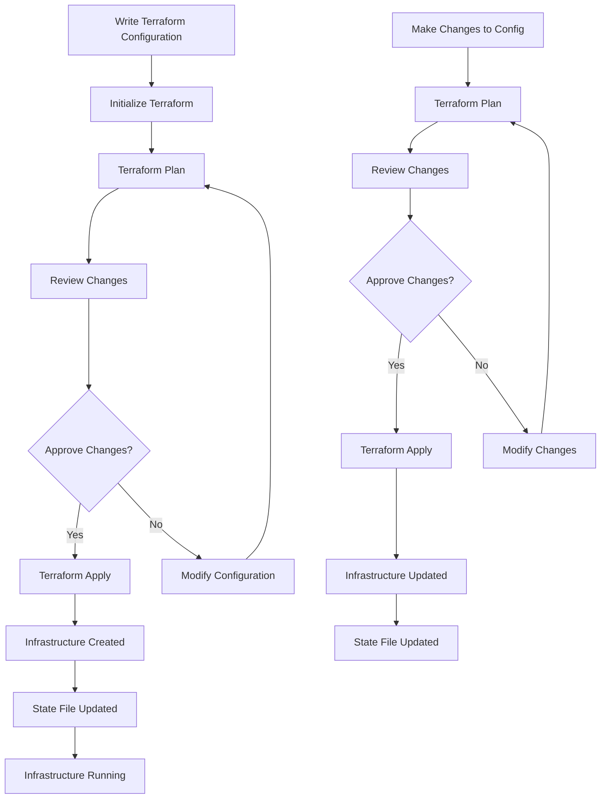
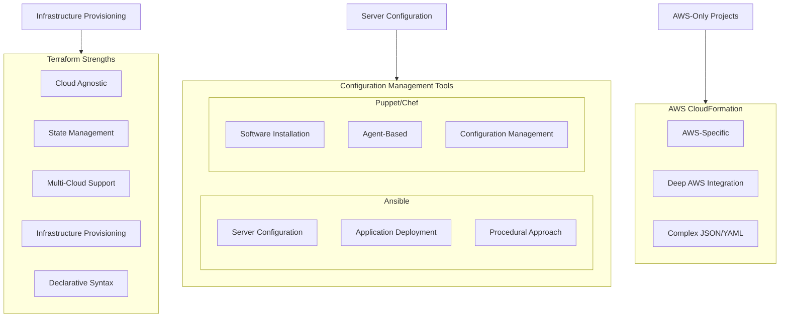

# Comprehensive Guide to Terraform

## Table of Contents
1. [Introduction to Terraform](#introduction-to-terraform)
2. [How Terraform Works](#how-terraform-works)
3. [Why Choose Terraform](#why-choose-terraform)
4. [Terraform vs Other Tools](#terraform-vs-other-tools)
5. [Best Practices and Implementation](#best-practices-and-implementation)

## Introduction to Terraform

Terraform is an Infrastructure as Code (IaC) tool developed by HashiCorp that enables users to define and provision infrastructure resources using declarative configuration files. It allows organizations to manage their infrastructure as code, making it versionable, testable, and repeatable.

### Key Features
- Declarative configuration language (HCL)
- Multi-cloud support
- State management
- Resource graph visualization
- Plan and apply workflow
- Rich provider ecosystem

## How Terraform Works

### Basic Workflow

1. **Write Configuration**
   ```hcl
   # Example Terraform configuration
   provider "aws" {
     region = "us-west-2"
   }

   resource "aws_vpc" "main" {
     cidr_block = "10.0.0.0/16"
     
     tags = {
       Name = "main-vpc"
     }
   }

   resource "aws_instance" "web" {
     ami           = "ami-0c55b159cbfafe1f0"
     instance_type = "t2.micro"
     
     tags = {
       Name = "web-server"
     }
   }
   ```

2. **Initialize Project**
   ```bash
   terraform init
   ```

3. **Plan Changes**
   ```bash
   terraform plan
   ```

4. **Apply Changes**
   ```bash
   terraform apply
   ```

### Workflow Diagram



## Why Choose Terraform

### Core Benefits

1. **Version Control**
   - Infrastructure code can be versioned in Git
   - Track changes and rollback capabilities
   - Collaborate with team members

2. **Consistency**
   - Same configuration creates identical infrastructure
   - Reduces human error
   - Ensures environment parity

3. **Automation**
   - Automated infrastructure deployment
   - Reduced manual intervention
   - Faster provisioning

4. **Documentation**
   - Self-documenting infrastructure
   - Clear dependency mapping
   - Improved knowledge sharing

5. **Multi-cloud Support**
   - Single tool for multiple providers
   - Consistent workflow across providers
   - Simplified hybrid cloud management

## Terraform vs Other Tools

### Comparison with Popular Alternatives

1. **Terraform vs. AWS CloudFormation**
   - CloudFormation is AWS-specific
   - Terraform supports multiple providers
   - Terraform's HCL is more user-friendly
   - Better state management in Terraform

2. **Terraform vs. Ansible**
   - Ansible: Configuration management focus
   - Terraform: Infrastructure provisioning focus
   - Ansible: Procedural approach
   - Terraform: Declarative approach

3. **Terraform vs. Puppet/Chef**
   - Puppet/Chef require agents
   - Terraform is agentless
   - Different primary use cases
   - Complementary tools rather than competitors

### Tools Comparison Diagram



## Best Practices and Implementation

### Project Structure
```
project/
├── main.tf
├── variables.tf
├── outputs.tf
├── terraform.tfvars
└── modules/
    ├── networking/
    ├── compute/
    └── database/
```

### Code Organization
```hcl
# variables.tf
variable "environment" {
  type        = string
  description = "Environment (dev/staging/prod)"
}

# main.tf
module "networking" {
  source      = "./modules/networking"
  environment = var.environment
}

module "compute" {
  source      = "./modules/compute"
  vpc_id      = module.networking.vpc_id
  environment = var.environment
}
```

### State Management Best Practices

1. **Remote State Storage**
   ```hcl
   terraform {
     backend "s3" {
       bucket = "terraform-state-bucket"
       key    = "prod/terraform.tfstate"
       region = "us-west-2"
     }
   }
   ```

2. **State Locking**
   - Use DynamoDB for state locking
   - Prevent concurrent modifications
   - Ensure data consistency

### Workflow Integration

1. **CI/CD Pipeline Integration**
   ```yaml
   # Example GitHub Actions workflow
   name: Terraform
   
   on:
     push:
       branches: [ main ]
   
   jobs:
     terraform:
       runs-on: ubuntu-latest
       steps:
         - uses: actions/checkout@v2
         - name: Setup Terraform
           uses: hashicorp/setup-terraform@v1
         - name: Terraform Init
           run: terraform init
         - name: Terraform Plan
           run: terraform plan
         - name: Terraform Apply
           if: github.ref == 'refs/heads/main'
           run: terraform apply -auto-approve
   ```

### Security Considerations

1. **Sensitive Data Management**
   ```hcl
   variable "database_password" {
     type        = string
     sensitive   = true
     description = "Database password"
   }
   ```

2. **Access Control**
   - Use IAM roles and policies
   - Implement least privilege principle
   - Regular access reviews

### Monitoring and Maintenance

1. **Resource Tagging**
   ```hcl
   resource "aws_instance" "web" {
     # ... other configuration ...
     
     tags = {
       Name        = "web-server"
       Environment = var.environment
       Team        = "DevOps"
       Managed_By  = "Terraform"
     }
   }
   ```

2. **Cost Management**
   - Use cost estimation tools
   - Implement auto-scaling policies
   - Regular infrastructure reviews

### Common Use Cases

1. **Multi-Cloud Deployment**
   ```hcl
   # AWS Resources
   provider "aws" {
     region = "us-west-2"
   }

   # Azure Resources
   provider "azurerm" {
     features {}
   }

   # Managing resources in both clouds
   resource "aws_instance" "web" {
     # AWS configuration
   }

   resource "azurerm_virtual_machine" "app" {
     # Azure configuration
   }
   ```

2. **Complete Infrastructure Setup**
   - Network configuration
   - Compute resources
   - Database services
   - Load balancers
   - DNS and SSL certificates

3. **Environment Parity**
   - Development
   - Staging
   - Production

## Conclusion

Terraform has become the de facto standard for infrastructure as code due to its flexibility, powerful features, and extensive provider ecosystem. When used properly with other tools in your DevOps toolchain, it provides a robust solution for managing infrastructure at scale.

Remember that Terraform works best as part of a complete infrastructure management strategy:
- Terraform for infrastructure provisioning
- Configuration management tools for application setup
- Container orchestration for application deployment
- CI/CD tools for automation

By following these best practices and understanding the appropriate use cases, organizations can successfully implement Terraform to manage their infrastructure effectively and efficiently.

