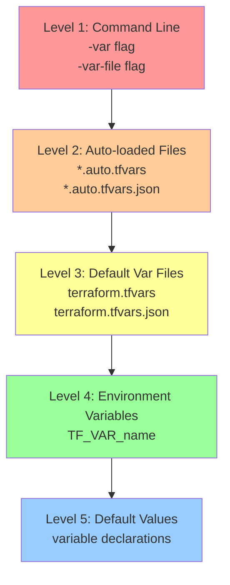

# Terraform Variable Precedence Levels with Command Tags

## Level 1 (Highest Precedence) - Command Line Flags
### Command-Line Options:
```bash
-var        # Highest precedence
-var-file   # Second highest (if multiple -var-file flags, last one wins)
```

Example:
```bash
terraform apply \
  -var="environment=prod" \           # This takes highest precedence
  -var-file="override.tfvars" \       # This takes precedence over auto.tfvars
  -var="instance_type=t2.large"       # For same variable, last -var wins
```

## Level 2 - Auto-loaded Variable Files
### Files named (processed alphabetically):
```
*.auto.tfvars
*.auto.tfvars.json
```

Example files:
```
production.auto.tfvars
staging.auto.tfvars
variables.auto.tfvars.json
```

## Level 3 - Default Variable Files
### Files named (in order):
```
terraform.tfvars
terraform.tfvars.json
```

## Level 4 - Environment Variables
### Format:
```bash
export TF_VAR_<variable_name>="value"
```

Example:
```bash
export TF_VAR_region="us-west-2"
export TF_VAR_instance_type="t2.micro"
```

## Level 5 (Lowest Precedence) - Default Values
### In variable declarations:
```hcl
variable "environment" {
  type    = string
  default = "development"    # Lowest precedence
}
```

## Full Example with All Levels

```hcl
# variables.tf (Level 5 - Lowest)
variable "environment" {
  type    = string
  default = "development"      # Will be overridden by higher levels
}

# terraform.tfvars (Level 3)
environment = "staging"        # Will be overridden by higher levels

# custom.auto.tfvars (Level 2)
environment = "production"     # Will be overridden by command line

# Environment Variable (Level 4)
export TF_VAR_environment="test"

# Command Line (Level 1 - Highest)
terraform apply \
  -var-file="override.tfvars" \
  -var="environment=prod"
```

## Command Line Precedence Rules

1. Multiple -var flags:
```bash
terraform apply -var="environment=dev" -var="environment=prod"
# Result: environment = "prod" (last value wins)
```

2. Multiple -var-file flags:
```bash
terraform apply \
  -var-file="common.tfvars" \
  -var-file="override.tfvars"
# Result: override.tfvars takes precedence
```

3. Combining -var and -var-file:
```bash
terraform apply \
  -var-file="common.tfvars" \
  -var="environment=prod" \
  -var-file="override.tfvars" \
  -var="instance_type=t2.large"
# Result: 
# - instance_type from last -var
# - other variables from last applicable flag
```

## Best Practices

1. Command Line Overrides (-var):
   - Use for temporary overrides
   - Use for CI/CD pipeline variables
   - Example: `-var="environment=prod"`

2. Variable Files (-var-file):
   - Use for environment-specific values
   - Use for reusable configurations
   - Example: `-var-file="prod.tfvars"`

3. Auto-loaded Files (*.auto.tfvars):
   - Use for consistent environment configs
   - Name by environment or purpose
   - Example: `production.auto.tfvars`

4. Environment Variables (TF_VAR_*):
   - Use for sensitive values
   - Use for CI/CD pipeline secrets
   - Example: `export TF_VAR_db_password="secret"`

5. Default Values:
   - Use for safe fallback values
   - Use for optional variables
   - Example: `default = "t2.micro"`

---

