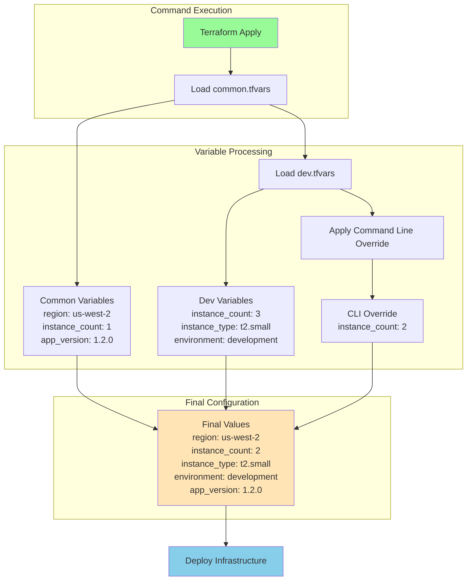

# Terraform Variable Precedence: A Practical Scenario

## Scenario: Web Application Deployment

Imagine you're deploying a web application with different configurations across environments. You have common settings and environment-specific settings, but need to make a quick adjustment to the instance count during deployment.

### Project Structure
```plaintext
webapp/
├── main.tf
├── variables.tf
├── common.tfvars
└── dev.tfvars
```

### 1. Variable Declarations
```hcl
# variables.tf
variable "environment" {
  type        = string
  description = "Environment name"
}

variable "instance_type" {
  type        = string
  description = "EC2 instance type"
}

variable "instance_count" {
  type        = number
  description = "Number of instances to launch"
}

variable "region" {
  type        = string
  description = "AWS region"
}

variable "app_version" {
  type        = string
  description = "Application version to deploy"
}

variable "enable_monitoring" {
  type        = bool
  description = "Enable detailed monitoring"
}
```

### 2. Common Variables
```hcl
# common.tfvars
region            = "us-west-2"
app_version       = "1.2.0"
enable_monitoring = true
instance_count    = 1     # Default instance count
```

### 3. Development Environment Variables
```hcl
# dev.tfvars
environment       = "development"
instance_type     = "t2.small"
instance_count    = 3     # Development environment typically needs 3 instances
enable_monitoring = false # Override monitoring for dev
```

### 4. Main Configuration
```hcl
# main.tf
resource "aws_instance" "web_server" {
  count = var.instance_count

  ami           = data.aws_ami.ubuntu.id
  instance_type = var.instance_type

  tags = {
    Name        = "${var.environment}-web-${count.index + 1}"
    Environment = var.environment
    AppVersion  = var.app_version
  }

  monitoring = var.enable_monitoring
}
```

### 5. Deployment Command
```bash
terraform apply \
  -var-file="common.tfvars" \
  -var-file="dev.tfvars" \
  -var="instance_count=2"
```

### 6. What Actually Happens?

Let's track how each variable gets its final value based on precedence:

1. First Load: common.tfvars
```hcl
region            = "us-west-2"      # ✓ KEPT (not overridden)
app_version       = "1.2.0"          # ✓ KEPT (not overridden)
enable_monitoring = true             # Will be overridden
instance_count    = 1                # Will be overridden
```

2. Then Load: dev.tfvars
```hcl
environment       = "development"     # ✓ KEPT (not overridden)
instance_type     = "t2.small"       # ✓ KEPT (not overridden)
instance_count    = 3                # Will be overridden
enable_monitoring = false            # ✓ KEPT (not overridden)
```

3. Finally Apply: Command Line Variable
```hcl
instance_count = 2                   # ✓ KEPT (highest precedence)
```

### 7. Final Effective Configuration

```hcl
# Final values used by Terraform
region            = "us-west-2"      # From common.tfvars
app_version       = "1.2.0"          # From common.tfvars
environment       = "development"     # From dev.tfvars
instance_type     = "t2.small"       # From dev.tfvars
enable_monitoring = false            # From dev.tfvars
instance_count    = 2                # From command line
```

### 8. Result

- 2 EC2 instances will be created (not 1 from common.tfvars or 3 from dev.tfvars)
- Instances will be of type t2.small
- Monitoring will be disabled
- Instances will be in us-west-2
- Instances will be tagged with app version 1.2.0
- Names will be "development-web-1" and "development-web-2"

### 9. Important Notes

1. **Precedence Order**: Command line > dev.tfvars > common.tfvars

2. **Overrides**: 
   - Values in dev.tfvars override common.tfvars
   - Command-line variables override both tfvars files

3. **Unspecified Values**:
   - Variables defined in earlier files remain if not overridden
   - Each level only overrides what it explicitly specifies

4. **Best Practices**:
   - Use common.tfvars for shared configurations
   - Use environment tfvars for environment-specific settings
   - Use command-line variables sparingly, mainly for temporary overrides

5. **Documentation**:
   - Always document when using command-line overrides
   - Consider adding comments in tfvars files to indicate expected override patterns

### 10. Variable Processing Flow Chart



### 11. Reading the Flow Chart

1. **Starting Point**:
   - The process begins with the terraform apply command
   
2. **Variable Loading**:
   - First loads common.tfvars (base configuration)
   - Then loads dev.tfvars (environment-specific)
   - Finally applies command-line overrides
   
3. **Value Resolution**:
   - Each step can override values from previous steps
   - Variables not overridden carry forward
   - Final configuration combines all sources with proper precedence

4. **Result**:
   - Final configuration used for deployment
   - Shows the winning values from all sources

---

